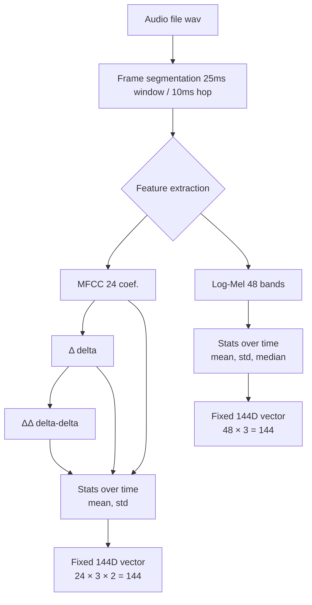

# MFCC_VoicePrint144

Extract a fixed **144-dimensional audio feature vector** from any `.wav` file for **speaker biometrics and voice analysis**.  
This project standardizes feature extraction using **MFCC + Δ + ΔΔ** or **Log-Mel (+PCEN)** within the human voice band (100–7200 Hz).  
It ensures consistent embeddings across devices and sampling rates.

---

## 📦 Features

- **MFCC 144D** → 24 MFCC × (static, Δ, ΔΔ) × (mean, std) = 144
- **Log-Mel 144D** → 48 Mel bands × (mean, std, median) = 144
- **Adaptive STFT** parameters (25 ms window / 10 ms hop, scaled to file sample rate)
- **Safe frequency band:** 100–7200 Hz (clamped at 0.45 × sample rate)
- **Optional PCEN** for robustness to gain/recording conditions
- Works with audios recorded on different devices and sample rates
- Always returns a fixed-length vector `[144]`

---

## 🛠️ Pipeline



> Every audio file (regardless of duration) is split into short frames (~25 ms).  
> From each frame we extract either **MFCCs (24 coef., Δ, ΔΔ)** or **Log-Mel energies (48 bands)**.  
> Instead of keeping all frames, we apply **statistical pooling** over time (mean, std, median).  
> This produces a **fixed-length 144D vector** that represents the global “voiceprint” of the speaker.

## 📂 Repository structure

```

MFCC\_VoicePrint144/
├─ README.md
├─ requirements.txt
├─ examples/
│  └─ sample.wav
└─ voiceprint\_features\_144/
├─ **init**.py
├─ cli.py
├─ common\_adaptive.py
├─ mfcc144.py
└─ mel144.py

```

---

## ⚙️ Installation

Create a virtual environment and install dependencies:

```bash
python -m venv .venv
source .venv/bin/activate      # Linux / macOS
.venv\Scripts\activate         # Windows

pip install -r requirements.txt
pip install -e .
```

Dependencies:

- `numpy`
- `librosa`
- `soundfile`
- `resampy` (for resampling)

---

## 🖥️ Usage (CLI)

Run the extractor on a `.wav` file:

```bash
# MFCC 144D
python -m voiceprint_features_144.cli examples/sample.wav --mode mfcc

# Log-Mel 144D (with PCEN)
python -m voiceprint_features_144.cli examples/sample.wav --mode logmel --pcen
```

### Options

- `--mode {mfcc|logmel}` → choose extractor (default: `mfcc`)
- `--pcen` → enable PCEN (only for `logmel`)
- `--no-down16k` → do not downsample to 16 kHz when sr > 16k
- `--out file.json` → save JSON output to file

---

## 🐍 Usage (Python API)

```python
from voiceprint_features_144 import extract_mfcc_144, extract_logmel_144

# MFCC 144D
vec, sr, band = extract_mfcc_144("examples/sample.wav")
print(vec.shape)   # (144,)
print(sr, band)    # e.g., 16000, (100, 7200)

# Log-Mel 144D (with PCEN)
vec, sr, band = extract_logmel_144("examples/sample.wav", use_pcen=True)
```

Output example:

```json
{
  "sr": 16000,
  "band": [100, 7200],
  "mode": "mfcc",
  "shape": [144],
  "features": [ ... 144 floats ... ]
}
```

---

## 🔬 Notes

- If audio has `sr < 16k`, no upsampling is performed; `fmax` is clamped to `0.45*sr`.
- For audios `sr ≥ 16k`, the signal is downsampled to 16k by default for consistency.
- Apply **z-score normalization** with mean/std from your training dataset before using in a neural network.

---

## 📜 License

MIT License (or your chosen license).
